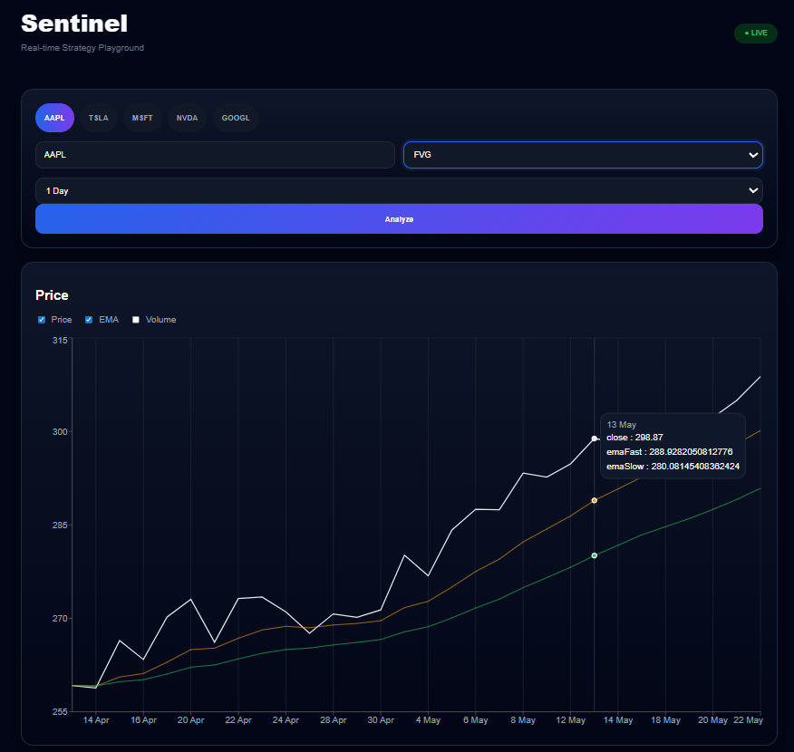
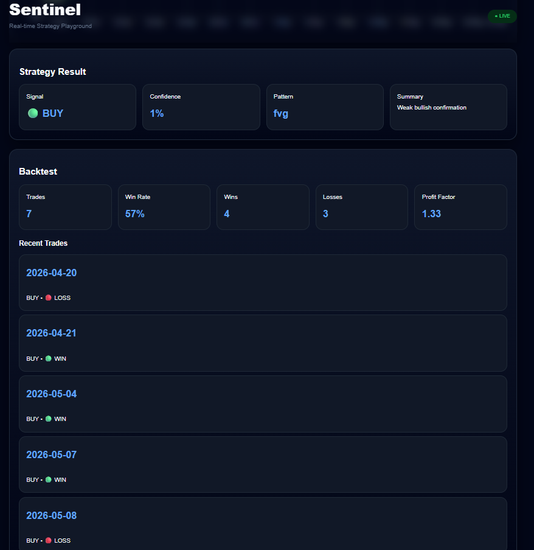
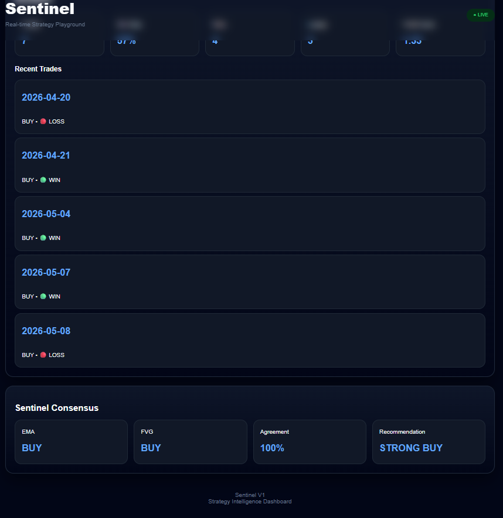
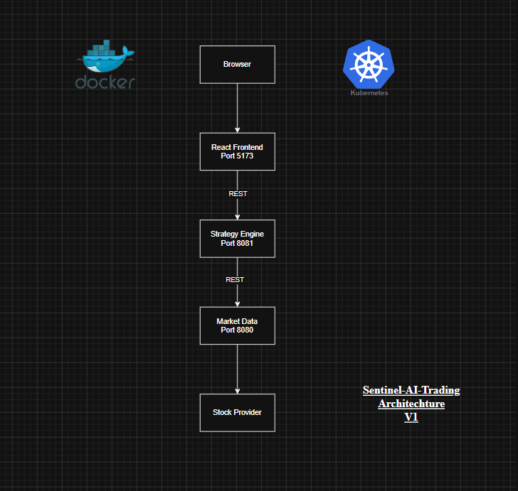

# Sentinel AI Trading Lab ☸️📈

A cloud-native trading strategy playground built using React, Spring Boot, Docker, and Kubernetes.

Sentinel allows users to analyze stock market behavior, test trading indicators, visualize signals, and simulate strategies through a modern dashboard.

---

# Sentinel







---

# Preview

```text
User
 ↓
Frontend (React + TypeScript)
 ↓
Strategy Engine
 ↓
Market Data Service
 ↓
External Market Provider
```

---

# Features

## Market Visualization

✔ Candlestick-style market view  
✔ Volume display  
✔ EMA overlays  
✔ Multiple timeframes  

Supported:

- 1 Day
- 1 Week
- 1 Month

---

## Strategy Playground

Run indicators on historical data.

Implemented:

### EMA
- Configurable Fast EMA
- Configurable Slow EMA
- Signal confidence

Example:

```json
{
  "pattern":"ema",
  "detected":true,
  "confidence":92
}
```

### FVG (Fair Value Gap)

Example:

```json
{
 "pattern":"fvg",
 "detected":true,
 "confidence":76
}
```

---

## Sentinel Consensus

Combine multiple indicators.

Example:

```json
{
 "recommendation":"BUY",
 "score":84
}
```

---

## Backtesting

Simulate strategy performance.

Metrics:

- Trades
- Wins
- Losses
- Win Rate
- Profit Factor
- Trade History

Example:

```json
{
 "trades":12,
 "wins":8,
 "winRate":67
}
```

---

# Tech Stack

## Frontend

- React
- TypeScript
- Axios
- Recharts
- CSS

## Backend

- Java 21
- Spring Boot
- JUnit 5
- Spring Boot Actuator
- Mockito

## DevOps

- Docker
- Docker Compose
- Kubernetes (Kind)

## Testing

Unit tests implemented using:

- JUnit 5
- Mockito

Coverage includes:

- Consensus Service
- Strategy Resolver
- Chart Service
- Backtest Service

Run tests:

```bash
mvn test
```

---

# Project Structure

```text
sentinel-ai-trading-lab/

frontend/
└── sentinel-ui/

backend/

├── market-data-service/

└── strategy-engine/

k8s/

docker-compose.yml

README.md
```

---

# Run Locally

## Build Services

```bash
cd backend/market-data-service
mvn clean package

cd ../strategy-engine
mvn clean package
```

---

## Start Containers

```bash
docker compose up --build
```

Open:

```text
http://localhost:5173
```

---

# Kubernetes Deployment

Create cluster:

```bash
kind create cluster --name sentinel
```

Load images:

```bash
kind load docker-image sentinel-ai-trading-lab-market-data --name sentinel

kind load docker-image sentinel-ai-trading-lab-strategy-engine --name sentinel

kind load docker-image sentinel-ai-trading-lab-frontend --name sentinel
```

Deploy:

```bash
kubectl apply -R -f k8s/
```

Verify:

```bash
kubectl get pods
```

Expected:

```text
frontend

market-data

strategy-engine
```

Access:

```bash
kubectl port-forward service/frontend 5173:5173

kubectl port-forward service/strategy-engine 8081:8081
```

Open:

```text
http://localhost:5173
```

---

# API Examples

## Playground

```http
POST /api/strategy/playground/ema/AAPL
```

Body:

```json
{
 "fast":9,
 "slow":21,
 "interval":"1day"
}
```

---

## Backtest

```http
POST /api/strategy/backtest/ema/AAPL
```

---

## Consensus

```http
POST /api/strategy/consensus/AAPL
```

---

## Observability

Spring Boot Actuator is enabled.

Health Endpoints:

GET /actuator/health
GET /actuator/info

---

# Future Roadmap

- Live streaming candles
- WebSocket updates
- Replay mode
- Equity curve
- More indicators
- Alerts
- Authentication

---

# Learnings

This project explores:

- Microservices
- REST APIs
- Frontend integration
- Strategy modeling
- Containerization
- Kubernetes networking
- Service discovery

---

# Version

**Sentinel V1**
